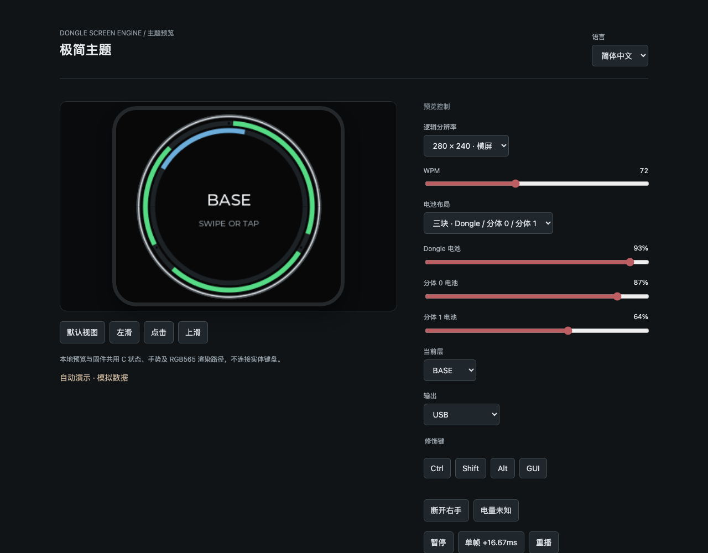
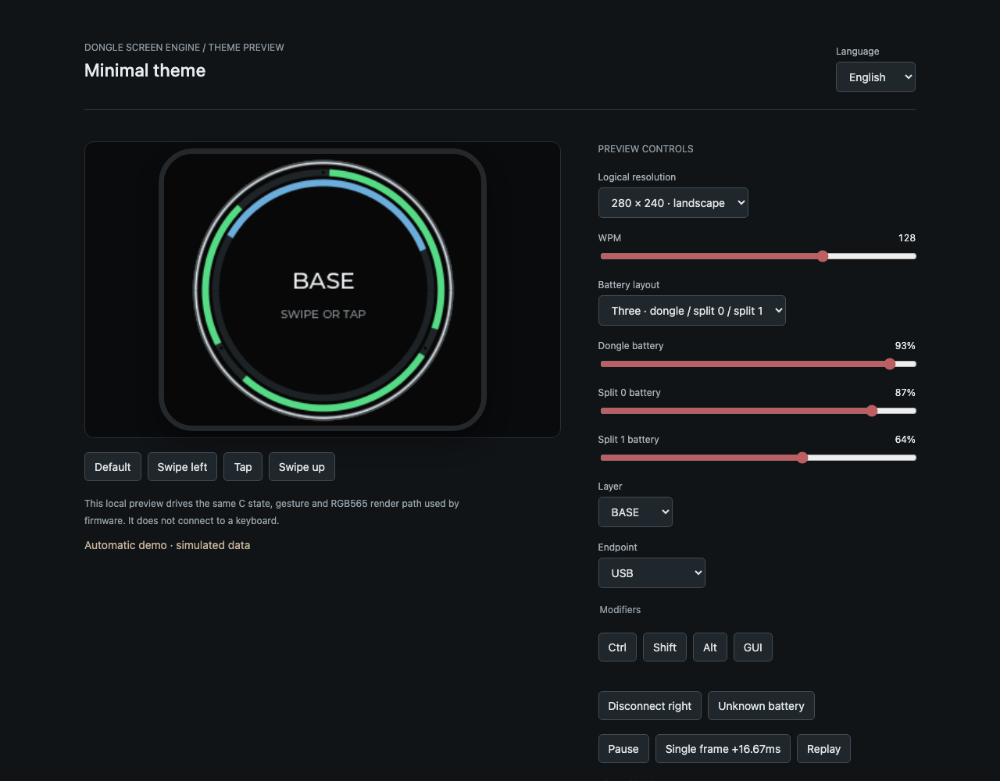
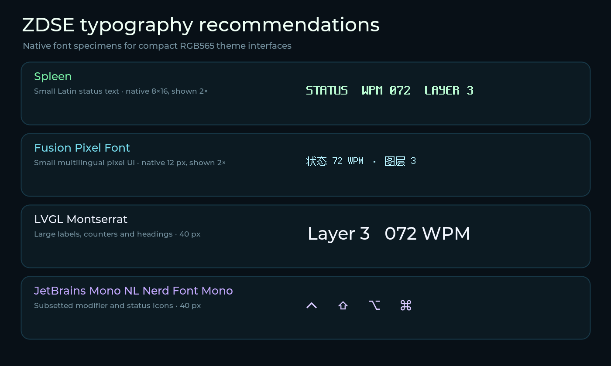

# zmk-dongle-screen-engine

A small static theme host and RGB565 renderer for ZMK dongles. It separates
display ownership, ZMK state projection, touch dispatch and frame transport
from the linked visual theme. Theme code stays in its own Zephyr module and
defines one static v1 or ABI 1.1 descriptor.

Current Engine release: **1.1.2**. Engine release versions and Theme ABI
versions are independent: Engine 1.1 retains Theme ABI v1 and adds the optional
versioned Theme ABI 1.1.

This repository contains the engine only. It does not contain downstream
themes, artwork, generated theme atlases, or product-specific animation labs.

## Agent entry points

Agents should begin with [AGENTS.md](AGENTS.md) for repository constraints.
Task-specific guidance lives under `skills/`; typography, font generation and
glyph-icon work must follow the [UI design skill](skills/ui-design/SKILL.md).
The [API manual](docs/api.md) and [development guide](docs/development.md) are
the corresponding entry points for interface and build/preview work.



## Highlights

### Same renderer in firmware and the browser

The preview builder compiles the engine, rasterizer and selected theme C sources
to both a native library and WASM. The generated HTML is self-contained and can
run offline. Live controls inject WPM, layers, endpoints, modifiers, two/three
battery layouts and gestures without a keyboard attached. The preview shell is
localized in English, Simplified Chinese and Japanese; text drawn inside the
simulated display remains entirely theme-owned.

The parity replay compares native and WASM RGB565 hashes across three display
sizes. It also verifies long-press de-duplication and that fixed spatial Bayer
dithering does not shimmer between stationary frames.

The preview shell also contains a hardware-budget simulator. Its nRF52840 +
ST7789 preset uses the board's 32 MHz SPI ceiling, direct RGB565 dirty row
bands, a default 60 FPS target and an adjustable CPU slowdown initially
calibrated from a measured 5 FPS radar workload. This preset is only an
initial estimate: the engine accepts arbitrary target FPS and animation
duration, while each dongle build chooses its own target. Unlimited
and custom modes permit A/B comparison. The shell reports logical, hardware
budget and browser-observed FPS separately, together with dirty tiles,
estimated render/transfer time, transfer bytes and dropped frames. This is a
relative engineering model, not a substitute for
on-device timing; calibrate the CPU multiplier with measured firmware data.



### Animation without a fixed player

A theme owns its animation state machine. Its `render(snapshot, now, pixels)`
callback returns nonzero while animation remains active; the host schedules the
next absolute frame deadline on ZMK's display work queue. `now` is explicit, so
native tests, WASM and firmware can replay the same timeline deterministically.
Optional animation selection, duration and forced-redraw hooks are available to
preview/settings adapters without making the engine interpret theme semantics.

The configured 60Hz value is a logical deadline, not a claim that every SPI
panel can present 60 physical frames per second. Retained tile damage, packed
rectangles and direct RGB565 row bands let themes trade memory, draw cost and
transport cost explicitly.

### Touch normalization

The engine accepts pointer samples through `dte_touch()` and emits tap, long
press and four directional swipes. `dte_touch_hint()` merges controller-provided
gesture hints with software recognition once per contact, preventing a hardware
swipe followed by a duplicate software swipe. Input callbacks enqueue samples;
theme callbacks and drawing remain serialized on the display work queue.
Themes may inspect the landscape-space gesture origin to partition a screen
without changing the theme descriptor. A bounded runtime backlight command
updates the WASM/native snapshot and delegates physical PWM to the ZMK host.

See [the API manual](docs/api.md) for descriptor, snapshot, animation, touch,
raster and transport contracts. Theme authors should also follow the
[development workflow](docs/development.md) and the
[pixel-art porting guide](docs/pixel-art-porting.md).

### RGB565 visual evidence

`scripts/compare_reference.py` compares a raw native/WASM framebuffer with a
reference after both enter the same RGB565 domain. It reports regional pixel
differences, generated-only bright speckles and local brightness spikes, and
can make selected regions strict CI gates. Pixel-art themes can request
nearest-neighbor preview scaling through their manifest without changing the
firmware renderer.

## Current contract

The bootstrap ABI supports one compile-time theme, 240x240, 240x280 and
280x240 RGB565 surfaces, WPM/layer/endpoint/modifier/battery snapshots, tap,
long press and four swipe directions, a configurable frame cadence, fixed Bayer RGB565
dithering, retained tile damage and optional direct display writes.

The host shield owns `zmk_display_status_screen()`. Do not combine it with
another custom status-screen shield. The present touch adapter targets the
Prospector-style portrait CST816S to landscape transform; other panel
orientations should provide an adapted host transform. Runtime theme registry,
safe fallback and arbitrary touch transforms are planned, not claimed by this
bootstrap release.

## ZMK integration

Add this repository and a theme repository as Zephyr modules in the ZMK west
manifest, then include these shields in the dongle build:

    <display-and-touch-hardware> dongle_screen_host <your-theme-shield>

The theme must include `zmk/dongle_theme/theme.h` and define either the frozen
v1 `const struct dte_theme dte_selected_theme` or the additive ABI 1.1
`const struct dte_theme_v1_1 dte_selected_theme_v1_1`. Existing v1 themes remain
source-compatible. New integrations should use ABI 1.1 for sized structures,
explicit validation status, fixed-width snapshots and render results. See the
[API manual](docs/api.md), `tests/api_v1_1.c`, and `examples/minimal-theme`.
The short [theme examples](docs/examples.md) page also links external visual
references.

Reusable RGB565 sprite and small pixel-UI helpers live in
`zmk/dongle_theme/ui.h`; keep theme palettes, layouts, animation policy, and
asset payloads in the theme module.

### Typography and icon fonts



Use [Spleen](https://github.com/fcambus/spleen) for compact Latin status text
and [Fusion Pixel Font](https://github.com/TakWolf/fusion-pixel-font) for small
multilingual pixel UI. Use LVGL's Montserrat for large labels and values, and a
strictly subsetted JetBrains Mono NL Nerd Font Mono for modifier/status icons.
The specimen shows Spleen 8x16 and Fusion Pixel Font 12 px at 2x nearest-neighbor
scale, plus Montserrat and Nerd Font at 40 px.

Font payloads remain opt-in theme assets and are not linked into Engine by
default. Theme authors and agents should use the
[UI design skill](skills/ui-design/SKILL.md) for selection, subsetting,
licensing and RGB565 validation rules; this README is only the short overview.

Useful Kconfig options include `ZMK_DONGLE_SCREEN_FPS`,
`ZMK_DONGLE_SCREEN_BRIGHTNESS`, `ZMK_DONGLE_SCREEN_DIRECT_RGB565`,
`ZMK_DONGLE_SCREEN_PACKED_RECTS` and `ZMK_DONGLE_SCREEN_DONGLE_BATTERY`.

## Native and WASM preview

The preview compiles the same engine, rasterizer and theme C source for native
execution and WASM. Point `--lvgl` at an LVGL source tree containing the
Montserrat font sources:

    python3 scripts/build_preview.py \
      --lvgl /path/to/lvgl \
      --theme examples/minimal-theme \
      --output .build/minimal-preview
    python3 scripts/test_preview.py .build/minimal-preview

Render an exact WASM framebuffer directly to PNG before opening a browser:

    node scripts/render_wasm.cjs .build/minimal-preview \
      --time 1000 --output .build/minimal-preview/frame-1000.png

Theme-specific integer setters may be applied with repeatable `--call
NAME=A,B`; deterministic gestures use `--gesture KIND@MS`. The command prints
the logical size, frame hash and PNG SHA-256. Browser inspection is reserved
for interactive controls, localization and responsive layout rather than
routine framebuffer review.

For animation evidence, `--frames 240 --fps 24 --output frame.png` drives one
WASM instance continuously and writes `frame-0000.png` through
`frame-0239.png`; an external encoder may package that deterministic sequence
as GIF, WebP or video without browser capture.

Open `.build/minimal-preview/index.html` locally. The replay test requires
Clang with wasm32 support and Node.js; it verifies matching native/WASM RGB565
frame hashes, long-press de-duplication and stable spatial dithering.

Themes with `variants` may also declare `common_sources`,
`profile_variants`, and localized-independent `variant_display_names`. Build
all declared profiles into one verified, self-contained page with:

    python3 scripts/build_preview.py \
      --lvgl /path/to/lvgl --theme /path/to/theme \
      --all-variants --output .build/theme-profiles

Each profile is linked and native/WASM parity-tested independently. The page
switches cached modules without reloading, reapplies Engine-visible state and
logical time, and forces a clean redraw. Existing single-source and
`--variant` commands retain their prior output contract.

## GitHub Action

Downstream theme repositories can build and verify the same self-contained HTML
without copying Engine scripts:

```yaml
- uses: actions/checkout@v7
- uses: actions/checkout@v7
  with:
    repository: zmkfirmware/lvgl
    ref: f1db87ee98f1810328a8419572fa42a3b5f352ae
    path: .preview-deps/lvgl
- id: preview
  uses: hitsmaxft/zmk-dongle-screen-engine/.github/actions/build-preview@v1.1.2
  with:
    theme-path: themes/my-theme
    lvgl-path: .preview-deps/lvgl
    output-path: site/my-theme
    # all-variants: 'true'  # optional profile bundle
```

The Action installs the Linux Clang/WASM toolchain when necessary, builds the
native and WASM renderers, runs parity replay, and exposes `index-path` and
`output-path` only after verification succeeds. Pin the Engine tag and LVGL
revision in release workflows.

## License

Engine and example code are MIT licensed. Generated preview font data retains
the LVGL MIT and Montserrat OFL notices from its source tree.
