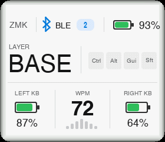

# zmk-dongle-screen-engine

`zmk-dongle-screen-engine` is a static theme host and RGB565 renderer for ZMK
dongles. It owns display lifecycle, ZMK state projection, touch dispatch,
animation scheduling and frame transport. A separate Zephyr module supplies one
compile-time visual theme.

Current release: **1.4.1**; Theme ABI: **1.3** (`0x0103`); TRE ABI: **1.0**
(`0x0100`).

Version 1.4.1 does not change either ABI. Existing ABI 1.3 themes remain source
and binary-contract compatible. See the [release notes](docs/releases.md).

This repository contains the Engine, reusable renderer, preview shell and a
minimal example. Product themes, artwork and generated theme atlases belong in
downstream theme modules.


## What the Engine provides

- A single static Theme descriptor with bounded `frame()` and `draw()` calls.
- ZMK snapshots for WPM, layer, endpoint, profile, modifiers, batteries,
  connection state, brightness and measured refresh rate.
- Continuous animation and exact monotonic deadlines without a fixed player.
- Normalized tap, long-press and four-way swipe input with optional controller
  hints and landscape-space touch origins.
- RGB565 drawing, fixed spatial Bayer dithering, sprites, bitmap text, metallic
  rings, retained damage and scoped circular exclusion.
- Bounded strip rendering or an optional retained full framebuffer with tile
  hashing and packed display writes.
- Native and WASM builds from the same C renderer, plus a localized interactive
  preview and an nRF52840 transport-budget model.

The Engine does not provide a runtime theme registry, scene graph, layout
language or automatic fallback theme. Theme layout, palette, assets, fonts and
motion remain theme-owned.

## Architecture

Firmware uses one serialized flow:

```text
ZMK events
  → snapshot
  → Theme frame plan and dirty rectangles
  → bounded Theme draw regions
  → optional frame filter
  → tile hash and RGB565 packing
  → display driver
```

The host shield owns `zmk_display_status_screen()`. Do not combine
`dongle_screen_host` with another custom status-screen shield.

TRE is the allocation-free render core beneath the Theme API. It exposes
caller-owned surfaces, images, glyph coverage, atlas tiles and damage storage
without depending on ZMK state. The existing `dtr_*` and `dte_ui_*` interfaces
remain compatibility and effects helpers. Details are in the
[API manual](docs/api.md).

## Display and transport contract

Supported logical scenes are 280×240, 240×280 and 240×240 RGB565. The host can
render into bounded strips or retain one full 280×240 framebuffer. Dirty
rectangles are conservative; changed output tiles are hashed before transfer.

Configured FPS is a scheduling target, not measured panel FPS. SPI command
overhead, DMA gaps, drawing cost and the lack of panel TE/vsync can reduce the
presented rate or expose tearing. Native and WASM measurements are software
evidence, not nRF52840 timing.

The default budget model uses 280×240 RGB565, 24 FPS, 32 MHz SPI, 20 percent
dirty area and one 4,480-pixel strip. A final Zephyr map is required for actual
firmware Flash and RAM figures.

## ZMK integration

Add the Engine and a theme repository to the ZMK West manifest. Pin release
commits or tags; do not build production firmware from a floating branch.

```yaml
- name: zmk-dongle-screen-engine
  url: https://github.com/hitsmaxft/zmk-dongle-screen-engine
  revision: v1.4.1
  path: zmodules/zmk-dongle-screen-engine
```

Build the dongle with:

```text
<display-and-touch-hardware> dongle_screen_host <theme-shield>
```

The theme includes `zmk/dongle_theme/theme.h` and defines exactly one
descriptor:

```c
const struct dte_theme dte_selected_theme = DTE_THEME_INIT(
    "theme-id", DTE_THEME_CAP_GESTURE,
    mount, gesture, frame, draw);
```

Existing allocation-free raster themes may start with
`DTE_THEME_RASTER_ADAPTER` or `DTE_THEME_RASTER_DEADLINE_ADAPTER`. Native region
callbacks are preferable when repeated strip traversal becomes expensive.

Useful firmware options include:

- `ZMK_DONGLE_SCREEN_FPS`
- `ZMK_DONGLE_SCREEN_BRIGHTNESS`
- `ZMK_DONGLE_SCREEN_STRIP_PIXELS`
- `ZMK_DONGLE_SCREEN_FULL_FRAMEBUFFER`
- `ZMK_DONGLE_SCREEN_OPTIMIZE_SPEED`
- `ZMK_DONGLE_SCREEN_MAX_THROUGHPUT`

## Native and WASM preview

The preview builder compiles Engine and Theme C sources to a native library and
WASM, runs an ABI probe, then emits a self-contained HTML page.

```sh
python3 scripts/build_preview.py \
  --lvgl /path/to/lvgl \
  --theme examples/minimal-theme \
  --output .build/minimal-preview

python3 scripts/test_preview.py .build/minimal-preview
```

The long replay checks native/WASM RGB565 equality, three display sizes,
deterministic output, touch lifecycle and stationary dithering. Render an exact
frame without a browser:

```sh
node scripts/render_wasm.cjs .build/minimal-preview \
  --time 1000 --output .build/minimal-preview/frame-1000.png
```

Open `.build/minimal-preview/index.html` for live state, gesture, locale,
filter and hardware-budget controls. The shell supports English, Simplified
Chinese and Japanese without reloading WASM or resetting Theme state. Text
inside the simulated display remains Theme-owned.

Pointer adaptation belongs only to the preview shell. It may mirror movement
to match mounted hardware, but must preserve the original contact origin and
must not alter firmware gesture mappings or Theme semantics.

## Filters and physical mask

`CONFIG_ZMK_DONGLE_SCREEN_FILTER_CRT` enables an allocation-free RGB565
post-process after Theme drawing and before tile hashing. It provides edge
darkening, configurable rounded corners and subtle glass highlights; it does
not warp geometry or allocate another framebuffer.

The browser's generic R43 rounded-screen mask is presentation-only and is
independent from the firmware filter radius.



## Verification and release gate

Preview success alone is not firmware evidence. For a cross-repository Engine
change:

1. Run the complete native Engine suite and native/WASM parity replay.
2. Commit and push Engine; merge its PR.
3. Pin the exact merged commit or release tag in the consumer West manifest.
4. Run `west update` and verify the dependency checkout HEAD.
5. Perform a pristine downstream Zephyr build inside its toolchain environment.
6. Inspect final Kconfig, map, UF2 address range and artifact hash.

Keep Engine-owned Zephyr output free of compiler warnings. Report unrelated
dependency or deprecated-Zephyr warnings separately rather than claiming a
globally warning-free build.

Downstream repositories can use the verified preview action:

```yaml
- uses: hitsmaxft/zmk-dongle-screen-engine/.github/actions/build-preview@v1.4.1
  with:
    theme-path: themes/my-theme
    lvgl-path: .preview-deps/lvgl
    output-path: site/my-theme
    target-fps: '24'
    spi-mhz: '32'
    dirty-percent: '20'
```

Pin LVGL separately. Supplying a final firmware map enables whole-image Flash
and RAM reporting; otherwise those values remain unavailable.

## Documentation

- [API manual](docs/api.md): ABI records, callbacks, rendering and input.
- [Development guide](docs/development.md): preview, performance, budgets and
  downstream validation.
- [Pixel-art porting](docs/pixel-art-porting.md): asset extraction and visual
  quality gates.
- [Theme examples](docs/examples.md): minimal and external reference themes.
- [UI design skill](skills/ui-design/SKILL.md): font choice, subsetting,
  licensing and RGB565 typography checks.
- [Release notes](docs/releases.md): compatibility and release history.

Agents should read [AGENTS.md](AGENTS.md) before modifying Engine source,
preview UI or documentation.

## License

Engine and example code are MIT licensed. Generated preview font data retains
the source LVGL MIT and Montserrat OFL notices.
